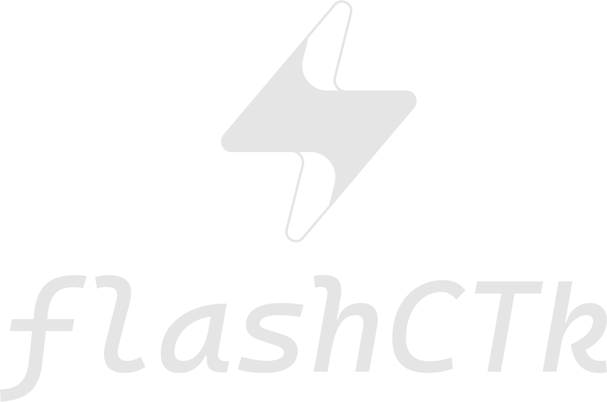

Um experimento inspirado no React, recriado em Python usando CustomTkinter.
Traz conceitos como useState, renderização reativa e componentes simplificados para facilitar a criação de interfaces gráficas.

Projeto de estudo, sem intenção de ser um framework oficial apenas uma forma divertida de testar ideias.
